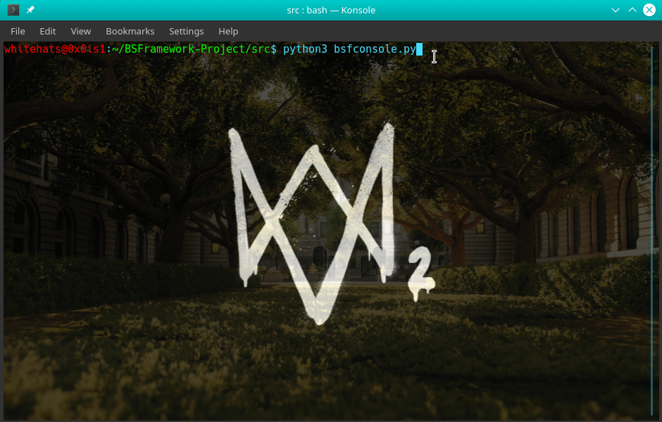

# DrHelp

[](https://travis-ci.com/StrinTH/DrHelp)
[](https://circleci.com/gh/StrinTH/DrHelp/tree/master)
[](https://ci.appveyor.com/project/0x0is1/DrHelp/branch/master) 

[](https://app.fossa.com/projects/git%2Bgithub.com%2FStrinTH%2FBSFramework?ref=badge_shield)
[](https://saythanks.io/to/0x0is1off@gmail.com)
### :Bio Sampler and research companion Framework
# 
#### For test release:

```sh
NOTE: Framework is still in its ALPHA MODE
```
### ***Sample Preview***

<p>Other samples <a href="assets/">here</a>.</p>


# Documentation

***

#### Options

| Features | Details | Examples |
| ------ | ------ | ------ |
| Set | use for setting id, item type, doc type etc.<a href="#set-options">Options</a>  | ```set id=1798174254 type=nuccore doc=html report=genbank```|
| Get | use for getting the data after setting creds with ```Set```.<a href="#get-options">Options</a>|```get gene```, ```get sequence```, ```get comment```, ```get all``` |
| Search | use for searching for any term available. <a href="#search-options">Options</a>| ```searchd /roma52``` or ```searchl /roma52```|
| Clear | use for clearing the console as usual | ```cls```|
| FTP* | use for getting any data files from http://ncbi.nlm.nih.gov  | ```ftp```|
| Options | use to get options for selected module | ```options``` |
| Help | use to get all available help options | ```help``` |
| Visualize* | use to open the scrapping page on browser if something is not working | ```visualize``` |
| Exit | use to exit the console | ```exit``` |

##### (*) options are under development


***


#### Set Options

| Options | Details | Examples |
| ------ | ------ | ------ |
| ID | NCBI use separate IDs for all data, so we can use the IDs to get required data, You can get the IDs of any species by ```searchl``` command.  | ```set id=<ID here>```|
| Item Type | NCBI use specific name for every category of species data you want to get. <a href="#item-type-informations">Available types</a> |```set type=<Item Value>```  |
| Report Type | NCBI use specific report type for different purposes <a href="#report-type-informations">Available types</a> | ```set report=<Report Name>```|
| Document Type | NCBI use html and text format. **NOTE**: *there is no CUSTOM ```get``` option available for text format. it will give whole page at once.*  | ```set doc=<doc type>``` html(custom options) or text(all)|

***


#### Item-type Informations

| Item | Details | Values |
| ------ | ------ | ------ |
| Nucleoid |  use to get nucleotide samples and other infos. | ```nuccore```|
| Genes |  use to get Genes samples and other infos. | ```gene```|
| Protein |  use to get Protein samples and other infos. | ```protein```|
| Probe |  use to get Probes infos. | ```probe```|
| Popset |  use to getPopset infos. | ```popset```|


***


#### Report-type Informations

| Reports | Details | Values |
| ------ | ------ | ------ |
| Genbank |  use to get nucleotide samples and other infos. | ```genbank```|
| FASTA |  use to get Genes samples and other infos. | ```fasta```|

***


#### Get Options

| Options | Details | Examples |
| ------ | ------ | ------ |
| Name | Use to get db based name of species.  | ```get name```|
| Introduction | Use to get introduction of species. |```get intro```  |
| Comments | Use to get comment on the report.| ```get comment```|
| Gene | Use to get gene of the selected species.| ```get gene```|
| Stem Loop | Use to get Stem Loop of the report.| ```get stem-loop```|
| Peptide | Use to get Peptide of the report.| ```get peptide```|
| CDS |  Use to get CDS of the report.| ```get cds```|
| Source |  Use to get Source of the report.| ```get source```|
| All |  Use to get complete page in text format of report.| ```get all```|

***

#### Search options
To search All detailed summary of search term:
```sh
searchd <ITEM VALUE> <TERM>
```
To search All IDs of search TERM:
```sh
searchl <ITEM VALUE> <TERM>
```

| Item | Details | Values |
| ------ | ------ | ------ |
| Nucleoid |  Use to search nucleotide samples and their list. | ```nuccore``` |
| Genes |  Use to search samples and other infos. | ```gene```|
| Protein |  Uses to search Protein samples and other infos. | ```protein```|
| Probe |  Uses to search Probes lists. | ```probe```|
| Popset |  Uses to search Popset lists. | ```popset```|


***

### <a href = "Documentations/documentation.md">Documentations</a>

### **Support authors**:

[](https://www.buymeacoffee.com/6dciIwk)

[](https://paypal.me/0x0is1?locale.x=en_GB)


## Contributing

Please read [CONTRIBUTING.md](CONTRIBUTING.md) for details on our [code of conduct](CODE_OF_CONDUCT.md) and the process of submitting pull requests to us.

## License 
[](https://github.com/StrinTH/DrHelp/blob/master/LICENSE)

This project is licensed under the MIT License - see the [LICENSE](LICENSE) file for details


[](https://app.fossa.io/projects/git%2Bgithub.com%2FStrinTH%2FBSFramework?ref=badge_large)

<a href="NOTICE.md">Notice</a>
