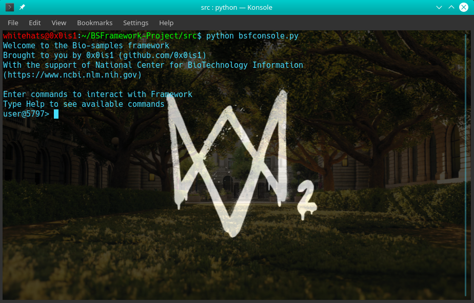

# BSFramework
[](https://saythanks.io/to/0x0is1off@gmail.com) 

### :Bio-Samples Framework
# 
#### For test release:

```sh
NOTE: Framework is still in its development MODE
```
### Project Build Status

Build status from different **Continous Integration Platform** for this  following Project *BSFramework*.

| Plateform | Build Status |
| ------ | ------ |
| BitRise | [](https://app.bitrise.io/app/3ca6b9357d67375f) |
| TravisCI | [](https://travis-ci.com/0x0is1/BSFramework) |
| CircleCI | [](https://app.circleci.com/pipelines/github/0x0is1/BSFramework) |
| AppVeyor | [](https://ci.appveyor.com/project/0x0is1/bsframework/branch/master) |
| Github Workflow |  |


### ***Sample Preview***



### **Support authors**:

<a href="https://www.buymeacoffee.com/6dciIwk" target="_blank"></a>

<a href="https://paypal.me/0x0is1?locale.x=en_GB" target="_blank"></a>


## Contributing

Please read [CONTRIBUTING.md](CONTRIBUTING.md) for details on our [code of conduct](CODE_OF_CONDUCT.md) and the process of submitting pull requests to us.

## License 
[](https://github.com/0x0is1/BSFramework/blob/master/LICENSE)

This project is licensed under the MIT License - see the [LICENSE](LICENSE) file for details